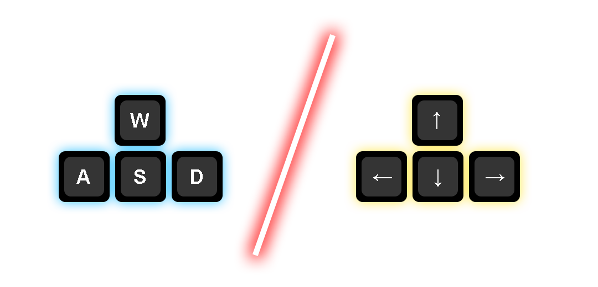

# 🐍 Snake Game

## 📕 Introduction

Hey everyone! This is my first snake game I've ever made. In addition, it took me time to make texture for wall because I am not really good in doing these stuff. That's everything I guess :D

*Seriously, I don't know what to say anymore in introduction.*

## 👾 How to play?

Just in case, you will find `How to play.txt` and `How to start the game.txt` in every version.
Make you meet the requirements before you download the game.

### Starting the game

**Windows:** If .jar is default extension being opened by java, you can just double click the file to run the game.

**Every Operating System (OS):**

```bash
java -jar Snake.jar
```

> **NOTE:** Make sure Java is installed in your device.

### Playing the game

Once you start the game, This following menu will appear:


After that, Click the "Play" button to start the game. 

If you obtain any errors when you try to run the game, please create an issue.


You can use these keys to control the snake:

- **WASD:**
  - W: Up direction
  - S: Down direction
  - A: Left direction
  - D: Right direction
- **Arrows:** Well, I think this is already obvious. Arrows do explain everything.



## ⚙️ Requirements

All you need is installing Java in your device to run the game. Operating System does NOT really matter as long as you are able to install Java on it.

|              | Minimum requirements | Recommended requirements |
| ------------ | -------------------- | ------------------------ |
| Java version | 8                    | 8                        |
| Free RAM     | +180 MB              | +256 MB                  |

> **NOTE:** Your device also needs to meet your Java version requirements to run the game.


😄 *Perhaps, there will be a lot of new things and changes in the next version.*

---

<div align="center">
    <b>Thank you for reading!</b>
</div>

